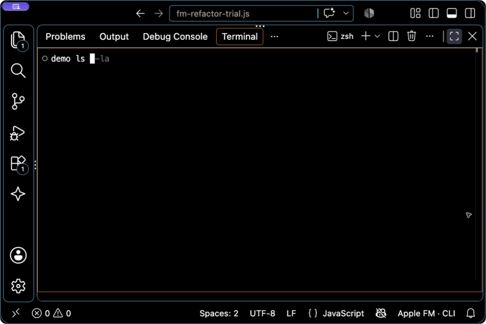

# Apple FM zsh autocomplete

This is a small zle plugin for macOS 27. It asks the on-device Apple model to complete the command line being typed, renders the part after the typed text, and inserts it into `LBUFFER` only when Tab is pressed. Enter remains the separate execution action.



Live on-device suggestion in VS Code’s integrated zsh terminal. Gray text is the suggested suffix; Tab accepts it without executing the command.

## Try it

For an isolated first trial, run `zsh -f` in Terminal, then:

```zsh
source /Users/monroe/Developer/GitRepos/FM/terminal/apple-fm.zsh
apple-fm-enable
```

Type a command prefix at the end of an otherwise empty line and pause for the default 350 ms, or invoke the explicit request with `Ctrl-X Ctrl-F` (`$APPLE_FM_TRIGGER`). Press Tab to insert a visible suffix. Escape dismisses it. `apple-fm-disable` restores the Tab and Escape bindings captured when enabled; `apple-fm-remove` disables and removes the plugin functions. No `.zshrc` is edited.

The CLI path is controlled by `$APPLE_FM_COMMAND` and defaults to `/usr/bin/fm`. Requests use stdin plus `respond --model system --no-stream --greedy`; prompts and history are not saved. A private transient result file is removed after response or cancellation. Set `APPLE_FM_DEBOUNCE` before enabling to change the delay.

The first version handles one line with the cursor at the end. It rejects multiline/control-character output and replies that don't start with the typed text, drops responses for changed buffers or directories, keeps only one active request and timer, and does not invoke generated text. Existing autosuggestion plugins remain responsible for their own display; if they also bind the same keys, load/order should be checked in the user's shell.

`./pty-smoke.exp` checks the plugin against the fake model in `fixture-fm`. `./dogfood.exp` types each line of `dogfood-cases.txt` into a real zsh with the real model and prints how each request ended, its time, and the buffer after Tab. The plugin keeps how the last request ended in `$_APPLE_FM_LAST_OUTCOME`.

## Install or update

On a supported macOS system with `/usr/bin/fm`, download the installer from the
latest GitHub release and run it as your user:

```zsh
curl -fsSL https://github.com/StoneHub/apple-fm-terminal/releases/latest/download/install.sh | sh
```

The installer downloads the latest archive and `SHA256SUMS`, verifies the archive
before unpacking it, and installs under `~/.local/share/apple-fm-terminal` with no
sudo. It adds one marked, idempotent block to `${ZDOTDIR:-$HOME}/.zshrc`; existing
configuration outside that block is preserved. Start a new zsh session afterward.

Once enabled, `apple-fm-update` repeats the verified latest-release update and
`apple-fm-version` prints the installed version. To test a locally built release
without changing the real home directory, set `HOME`, `ZDOTDIR`, and
`APPLE_FM_INSTALL_DIR` to directories under a temporary home and invoke the
installer with `--archive`.

The release maintainer can build the versioned archive, generic latest-download
archive, and checksum manifest with:

```zsh
./package-release.sh
```

The script only creates local files under `dist`; publishing release assets is a
separate step.
